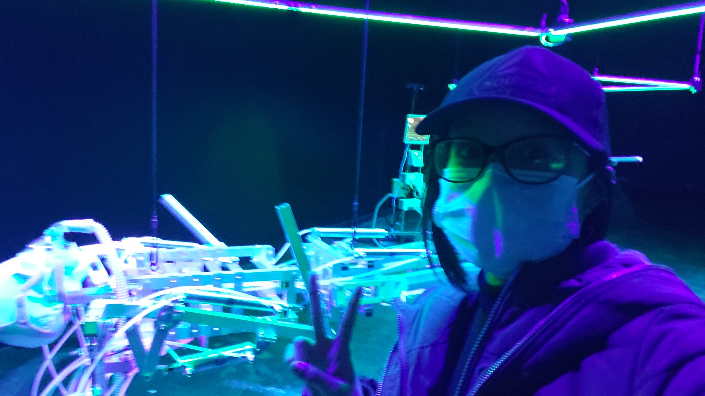
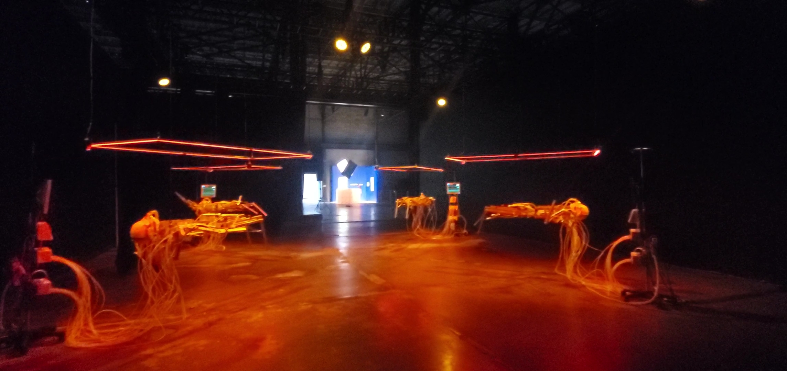
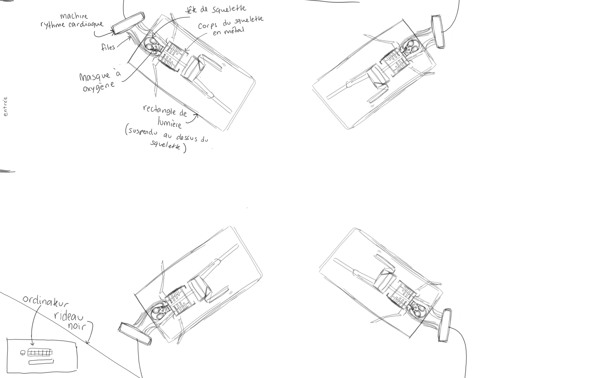

# BIAN - MÉTAMORPHOSIS

 **Lieu de mise en exposition :** Arsenal art contemporain - 2020 Rue William à Montréal
 
 **Visité le :** 9 Février 2022
 
 
 
 ---

## I.C.U Intensive Care Unit

 

 **Réalisé par :** Bill Vorn en 2021

 **Description :** (de l'oeuvre ou du dispositif multimédia à composer ou reprendre la description offerte sur le site de l'artiste ou le cartel de l'exposition en citant bien sa source)

 **La mise en espace :** (de l'oeuvre ou du dispositif : (texte à composer))
 
  

 **Composantes et techniques de l'oeuvre ou du dispositif :** 
 - ex.réalité virtuelle
 - ex.projecteurs
 - ex.caméra USB
 - ex.anneau lumineux

 **Éléments nécessaires pour la mise en exposition :**
 - ex.crochets
 - ex.sac de sable
 - ex.câbles de soutien

---

 ## Expérience vécue

 **Mon expérience :** ( de l'oeuvre ou du dispositif, de l'interactivité, des gestes à poser, etc.)

 💛 J'ai beaucoup aimé le fait que les squelettes soient suspendus par le plafond et non sur une table. Je trouve que c'est original et que ça rend le tout moins encombrant. De plus, ça permet de mettre de l'emphase sur le sujet qui est le squelette.
 
 🤔 Si j'avais à le faire autrement, j'aurais fait en sorte que la pièce soit complètement fermée pour avoir une meilleure immersion.

