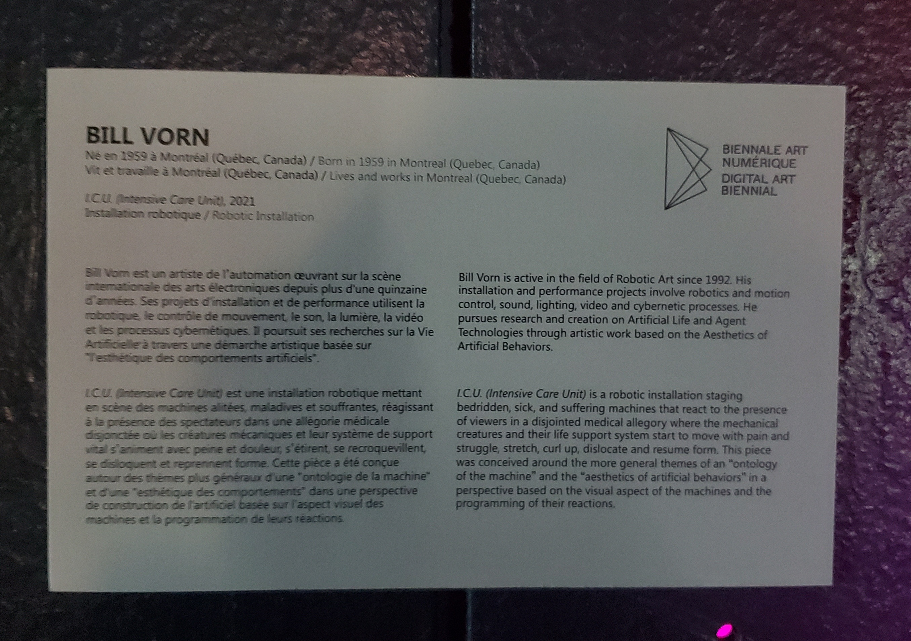
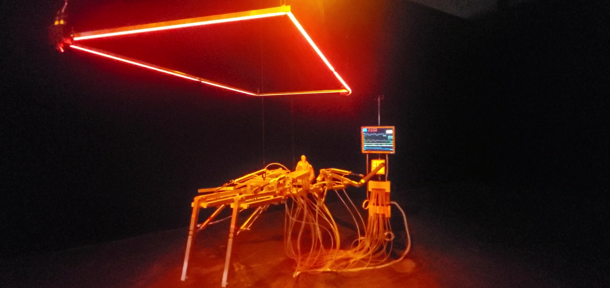
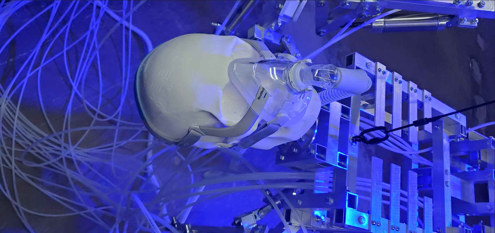
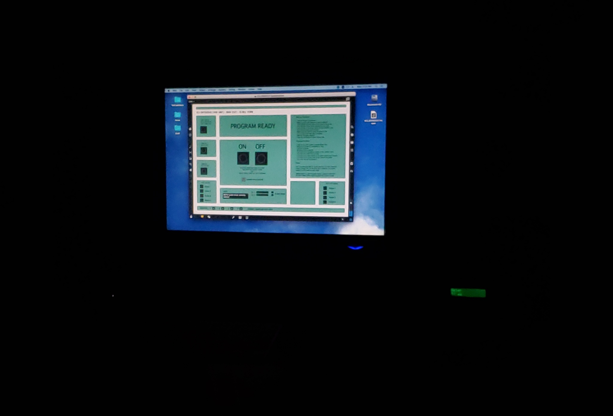
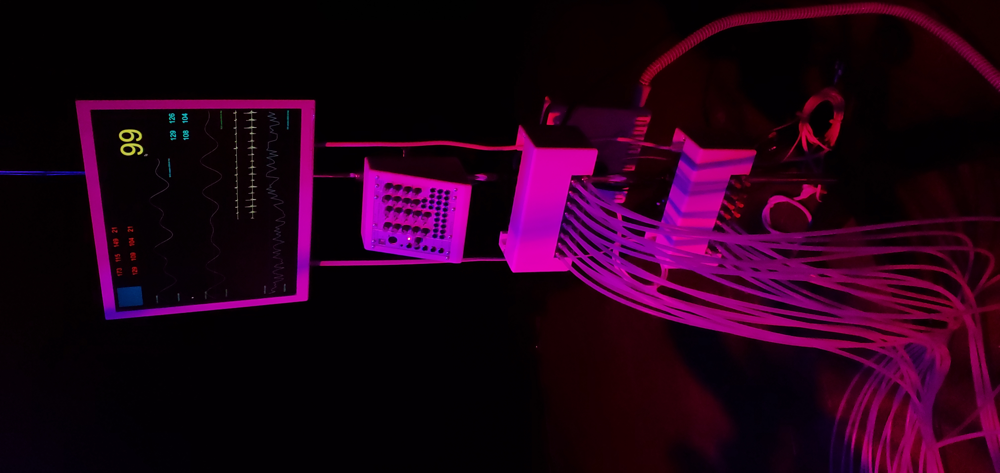
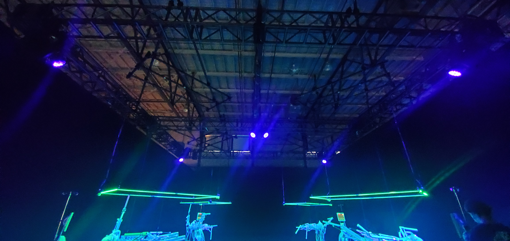
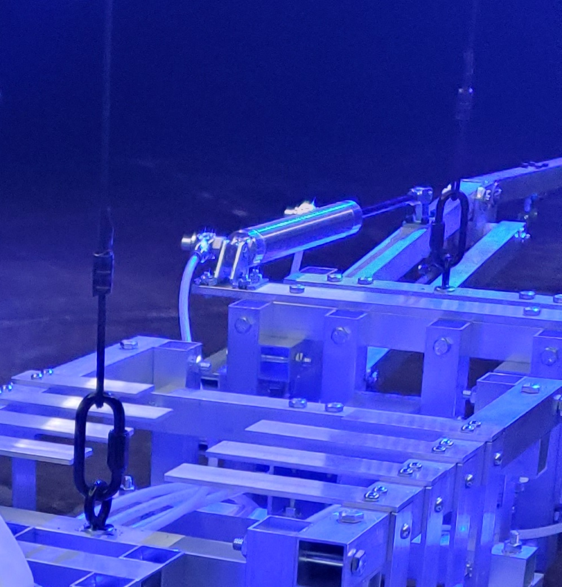

# BIAN - MÉTAMORPHOSIS

 **Lieu de mise en exposition :** Arsenal art contemporain - 2020 Rue William à Montréal
 
 **Visité le :** 9 Février 2022
 
 
 
 ---

## I.C.U Intensive Care Unit

 

 **Réalisé par :** Bill Vorn en 2021

 **Description :** I.C.U (Intensive Care Unit) est une installation robotique mettant en scène des machines alitées, maladives et souffrantes.
 
 *Source : Le panneau descriptif de l'oeuvre.*
 
  

 **La mise en espace :** L'installation se retrouve dans un grand espace sombre séparer des autres oeuvres grace à de grands rideaux noirs. La salle a comme source de lumière 6 projecteurs qui change de couleur occasionnellement. Il y a 4 robots suspendus horizontalement et sont placés au 4 coins de la pièce. Il y a un projecteur accroché au plafond à chaque coin de la pièce et deux au centre.
 
  

 **Composantes et techniques de l'oeuvre ou du dispositif :** 
 - Anneau rectangulaire lumineux
 - Tête de squelette
 - Pièces en métal
 - Files
 - Système de support vital
 - Ordinateur
 - Masque à oxygène
 - Projecteur
 

 **Éléments nécessaires pour la mise en exposition :**
 - Crochets
 - Câbles de soutien
 - Prises électriques
 - Poutre métallique 

---

 ## Expérience vécue

 **Mon expérience :** Dès que l'on rentre dans la pièce, on voit des squelettes en mouvement flotter dans les airs ainsi que des projecteurs qui changent la couleur de la pièce. Donc, ma première impression fut que ça ressemblait à une scène de science-fiction. De plus, avec les bruitages de battement de coeur ainsi que des machines en mouvement, le tout rendait l'installation encore plus intéressante, car ça a rajouté de l'immersion à mon expérience.

 💛 J'ai beaucoup aimé le fait que les squelettes soient suspendus par le plafond et non sur une table. Je trouve que c'est original et que ça rend le tout moins encombrant. De plus, ça permet de mettre de l'emphase sur le sujet qui est le squelette.
 
 🤔 Si j'avais à le faire autrement, j'aurais fait en sorte que la pièce soit complètement fermée pour avoir une meilleure immersion.

